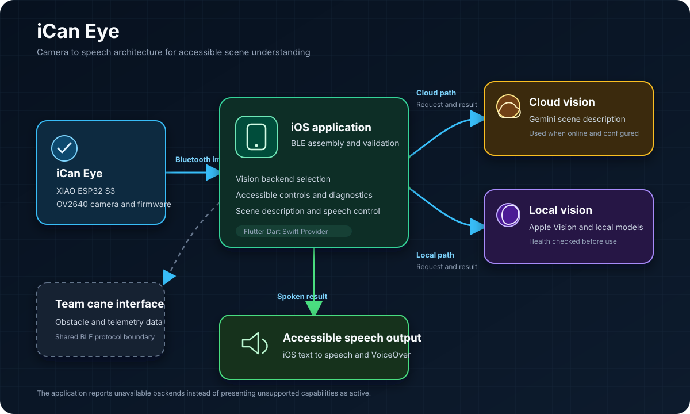

# iCan Eye

iCan Eye is an accessible camera system that moves an image from an ESP32 camera to an iPhone, selects an available vision backend, and speaks a useful scene description.

The project joins embedded firmware, Bluetooth communication, Flutter application development, native iOS vision, cloud vision, and accessible speech output in one working path.

## Ownership

Saber Garibi built the application and fully owned the iCan Eye subsystem. That work includes the camera firmware, Bluetooth image path, application integration, vision routing, diagnostics, and spoken output.

The broader iCan capstone also included team owned cane hardware. This page separates the application and iCan Eye work from that shared boundary.

## How the system works

1. The XIAO ESP32 S3 captures a JPEG image with the OV2640 camera.

2. Firmware sends capture events and image chunks through the shared Bluetooth protocol.

3. The Flutter application validates and assembles the image on the phone.

4. Runtime health checks select Gemini or an available local vision path.

5. The application presents the description and speaks it through iOS text to speech.

## Engineering decisions

### Treat image transfer as a protocol

The camera path carries size, sequence, checksum, completion, and error information instead of assuming that every Bluetooth notification arrives in order. The application retains exact diagnostic states for missing, stalled, incomplete, or corrupt transfers.

### Keep cloud and local vision honest

The application checks backend health before selecting a model. If a local model or native service is unavailable, the interface reports the limitation rather than presenting unsupported behavior as active.

### Design the result for audio use

The main interaction path supports accessible controls, VoiceOver semantics, speech settings, concise scene prompts, and spoken diagnostics. Scene understanding is treated as an audio product rather than a visual caption added at the end.

### Share one Bluetooth contract

The protocol definition in `protocol/ble_protocol.yaml` is mirrored in Dart and C plus plus. That boundary keeps firmware packets and application parsing aligned as the system evolves.

## Evidence in the repository

The iCan Eye firmware is in `firmware/ican_eye`.

Bluetooth transport and image assembly are in `lib/services/ble_service.dart`.

Scene routing is in `lib/services/scene_description_service.dart`.

Native vision integration is in `ios/Runner/EyePipeline` and `lib/services/on_device_vision_service.dart`.

Application behavior and speech orchestration are in `lib/models/home_view_model.dart`.

Protocol, service, settings, and widget checks are in `test`.

## Scope and maturity

iCan is an engineering prototype that reached integrated hardware and application testing. Cloud vision is the most reliable demonstration path. Bluetooth camera capture and local vision depend on the connected hardware, iOS version, bundled models, and runtime health checks.

Navigation and some broader cane features remain outside the strongest iCan Eye demonstration path. They are not presented as complete product capabilities here.

## Documentation

The concise technical map is in [`docs/TECHNICAL_OVERVIEW.md`](docs/TECHNICAL_OVERVIEW.md).

The presentation runbook is in [`docs/PRESENTATION_DEMO.md`](docs/PRESENTATION_DEMO.md).

The documentation index is in [`docs/DOCUMENTATION_INDEX.md`](docs/DOCUMENTATION_INDEX.md).
